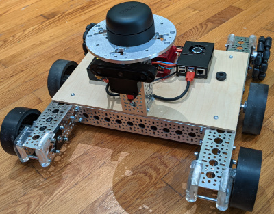

# Red-Crash
<div style="float:right"></img></div>
This is a living project for the Red-Crash robot that I am building as part of the Social Distancer team's entry into the <a href='https://opencv.org/opencv-ai-competition-2021/'>2021 OpenCV AI Contest</a>. This is not intended as an instructable or how-to, but as an open way to expose my work and living documentation for myself. I also keep a <a href="https://docs.google.com/document/d/1KZ22YjeubW1ue_mEz4UHqUBV7ftl6lgPlzKsD_fNuHw/edit?usp=sharing">todo list in Google docs</a>.

## Planned capabilities
- Indoor Navigation
- Lidar SLAM
- Voice Control
- 3d Vision based obstacle detection
- AI Vision based object detection

## Hardware so far

- GoBilda BeeLine chassis
- RPLidar A3
- OAK-D Camera
- RoboClaw motor controller
- Raspberry PI 4b 8gb
- USB Speaker

## Techniques / Software

- ROS Melodic
- Customized RoboClaw ROS Driver
- Components run within Docker
- Designed for RosBridge / WebViz monitoring

## Hacking

### VsCode and SSH
I tend to do all development through SSH and VsCode connected remotely from my desktop computer. 

### Git

This project uses submodules.  To clone, use 
```
git clone --recurse-submodules git@github.com:berickson/red-crash.git
```
To 
get latest changes
```
git pull --recurse-submodules 
``` 

### Rasberry Pi Prep
Use standard image and and install Docker. I started with Ubuntu Ubuntu Server 20.04.2 LTS
hostname is set to red-crash

### Docker
Build the docker image by executing docker/build
Dockerfile is in docker/Dockerfile
Launch the docker image by executing docker/start
The Docker container will be running "screen", so you can create multiple terminals

### ROS
All ROS code and modules are in the ws folder.
go.launch is intended to start all of the basic functions

### WebViz

Run WebViz docker on desktop PC with
```
docker run -p 8080:8080 cruise/webviz
```
Then browse to http://localhost:8080/?rosbridge-websocket-url=ws://red-crash:9090


### udev rules
To make "nice" and more importantly permanent device names, put following in /etc/udev/rules.d/89-local.rules.  This will cause your devices to be listed under /dev/roboclaw and /dev/oak-d, etc.
```
ATTRS{idVendor}=="03eb", , ATTRS{idProduct}=="2404", SYMLINK+="roboclaw"
ATTRS{idVendor}=="03e7", , ATTRS{idProduct}=="2485", SYMLINK+="oak-d"
ATTRS{idVendor}=="10c4", , ATTRS{idProduct}=="ea60", SYMLINK+="lidar"
ATTRS{idVendor}=="054c", , ATTRS{idProduct}=="0268", SYMLINK+="ps3-joystick", MODE="0666"

```
then reboot.


### connecting with Playstation controller
From command line:
```
bluetoothctl
scan on
```

Plug in controller using a micro-usb cable, you should see 

```
[NEW] Device 00:23:06:A6:66:2C Sony PLAYSTATION(R)3 Controller
```

then

```
pair 00:23:06:A6:66:2C
scan off
exit
```
